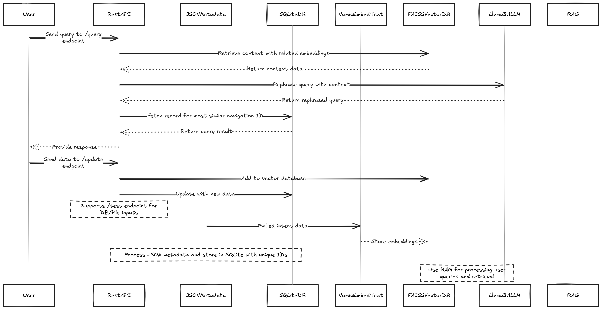

# Aatmun - Research & Development

### Architecture Diagram



## Installation

It is recommended to use `pipenv` to manage dependencies.

```bash
# install pipenv
pip install pipenv
```

```bash
# create a pipenv shell/virtualenv
pipenv shell
```

```bash
# install packages
pipenv install
```

## Running

The project is designed to run as docker containers with live reload.

Simply run:

```bash
make dev
```

This will use the [docker-compose.yml](./docker-compose.yml) and build a FastAPI container image based on [Dockerfile](./Dockerfile).

```bash
docker ps --format '{{.Names}}'
```

```
aatmun-api
ollama
```
## Development

All R&D steps have been documented as jupter [notebooks](./notebooks/). They can be explored by installing `jupter`

```bash
pip install jupyter
```

and running:

```bash
jupyter notebook
```

## Running

## To-Do:

* Expose endpoints for sqlite
* Auto db init (if not exists)